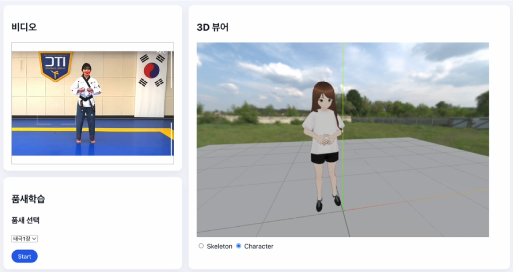

📄 [한국어 버전](README.md)

# Web-based Taekwondo Motion Visualization and Analysis Platform
## Web Visualization of Motion Skeletons

**2025 Dongguk University Capstone Design** Team Friday (2025.03 - 2025.12)

This project presents a web-based platform that visualizes Taekwondo poomsae motions using 3D skeletal representations and character animation, and evaluates the motions based on the extracted skeleton data from videos.

<p align="center">
  
</p>
<p align="center">
  Demo Video:  
  https://youtu.be/PpYY7dqxQ4Q
</p>

## Project Overview

The system consists of a **Client** and a **Server**, each responsible for distinct roles within the overall pipeline.

- **Client**: Provides 3D skeleton visualization, video playback, motion recording, and display of evaluation results in a web browser environment.
- **Server**: Handles user authentication, management of video and skeleton data, and storage of evaluation scores.

The motion evaluation model is implemented using **Keras** and deployed in the web client through **TensorFlow.js**.
- **Inference**: Classification of Taekwondo poomsae motions and output of motion accuracy scores
- Training Dataset: [AI-Hub Goyang City Taekwondo Dataset](https://aihub.or.kr/aihubdata/data/view.do?dataSetSn=71259)


## System Architecture

```
Client (Web Browser)
├── React + TypeScript
├── BlazePose GHUM (MediaPipe)
├── Three.js (3D Skeleton & Character Animation)
├── TensorFlow.js (Inference)
└── REST API
↓
Backend Server (AWS EC2)
├── Spring Boot (Java 21)
├── JWT Authentication
├── MySQL (AWS RDS)
└── AWS S3 (Video and Skeleton Data Storage)
```


## Key Features
### Client
- 3D skeleton visualization based on Three.js
- Synchronized rendering of video playback and skeletal motion
- Motion recording and playback
- Motion score visualization through an Evaluation Panel
- Video upload and download using AWS S3 Presigned URLs

### Server
- JWT-based user authentication and authorization
- Management of video and skeleton metadata
- Uploading and retrieval of skeleton data
- Storage and retrieval of motion evaluation scores
- Generation of AWS S3 Presigned URLs

### Inference
- LSTM-based motion classification
- Input: Time-ordered 3D landmark frames
- Output: Poomsae motion class and accuracy score

## Tech Stack
### Client
- React
- TypeScript
- Three.js
- [Three-vrm](https://github.com/pixiv/three-vrm)
- MediaPipe
- TensorFlow.js
- HTML5 / CSS3

### Server
- Java
- Spring Boot
- MySQL (AWS RDS)
- AWS EC2 / S3
- JWT Authentication

### Inference
- Python
- TensorFlow
- Keras
- TensorFlow.js
